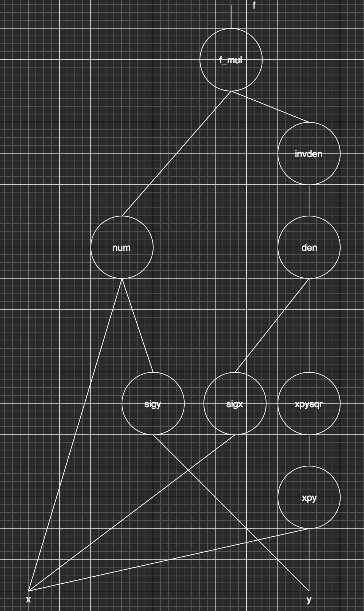

The backpropagation algorithm brought back from the winter neural networks as it made feasible to train very deep architectures by dramatically improving the efficiency of the gradient of the loss with respect to all the network parameters. 

In this section we will go over the calculation of gradient using an example function and its associated computational graph. The [example](http://cs231n.github.io/optimization-2/) does not have anything to do with DNNs but that is exactly the point. The essence of backpropagation was known far earlier than its application in DNN.

## Calculating the Gradient of a Function
Our goal is to compute the components of the gradient of the function  $\nabla f = [ \partial f / \partial x , \partial f / \partial y ]^T$ where,

$f(x, y) = \frac{x + \sigma(y)}{\sigma(x) + (x+y)^2}$

The computational graph of this function is shown below.  Its instructive to print this graph and pencil in all calculations for both this example and others in the backpropagation section. You may need to review derivative tables from Calculus e.g. http://cs231n.stanford.edu/handouts/derivatives.pdf 


    
### Forward Pass
In the forward pass, the algorithm works bottom up (or left to right depending how the computational graph is represented) and calculates the values of all "gates" (gates are the elementary functions that synthesize the function) of the graph and stores their values into variables as they will be used by the backwards pass. There are eight values stored in this specific example. 

```python
        sigy = 1.0 / (1 + exp(-y))  #(1)
        num = x + sigy # numerator    #(2)

        sigx = 1.0 / (1 + exp(-x)) #(3)
        xpy = x + y     #(4)
        xpysqr = xpy**2     #(5)
        den = sigx + xpysqr # denominator    #(6)
        invden = 1.0 / den   #(7)
        
        f = num * invden #(8)
  ```

### Backwards Pass
In the backwards pass, we reverse direction and start at the top or rightmost node (the stored variables) of the graph and compute the input (in the reverse direction) derivative of input of each gate 

```python
        # gradient at the top
        df = 1.0

        # backprop f = num * invden
        dnum = 1.0 * invden # gradient on numerator   #(8)
        dinvden = 1.0 * num         #(8)
        
        # backprop invden = 1.0 / den 
        dden = (-1.0 / (den**2)) * dinvden   #(7)
        
        # backprop den = sigx + xpysqr
        dsigx = (1) * dden      #(6)
        dxpysqr = (1) * dden     #(6)
        
        # backprop xpysqr = xpy**2
        dxpy = (2 * xpy) * dxpysqr     #(5)

        # backprop xpy = x + y
        dx = (1) * dxpy         #(4)
        dy = (1) * dxpy         #(4)
        
        # backprop sigx = 1.0 / (1 + exp(-x))
        dx += ((1 - sigx) * sigx) * dsigx # ATTENTION !!
        
        # backprop num = x + sigy
        dx += (1) * dnum         #(2)
        dsigy = (1) * dnum         #(2)
        
        # backprop sigy = 1.0 / (1 + exp(-y))
        dy += ((1 - sigy) * sigy) * dsigy       #(1)
```


*As the previous example indicated, the essense of backpropagation algorithm is that local gradients can be calculated symbolically (using calculus) as they only depend on the simple gate structures and these gradients act as valves in the gradient flow that starts from the top of the network (the value of the flow there is always 1.0) and propagates to the bottom of the graph. Think about it as valves controlling the water flowing down a river delta. Individual flows may also merge like in the example above.*


# Backpropagation of a simple NN


*
<!-- Vectorized Gradients Computational Graph -->
    
<!--  -->

Tensorflow can create a computational graph from the DNN model specification (python). These graphs can be visualized on the web UI with Tensorboard. Use the playground when you first learn about DNNs to understand the principles but dive into the MNIST using Tensorflow use case to understand the Tensorflow mechanics and how to debug Tensorflow python scripts both syntactically and logically. Logical debugging should happen using Tensorboard visualizations. 

