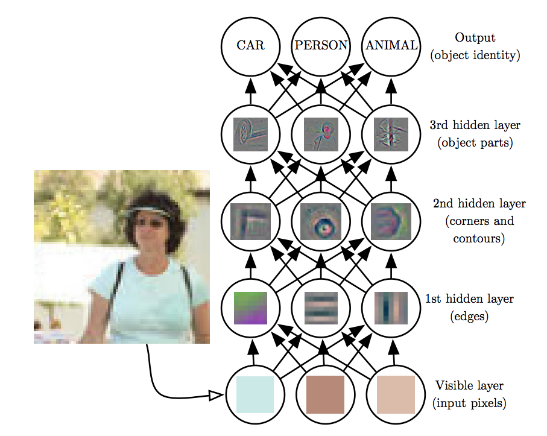

DNNs are the implementation of **connectionism**, the philosophy that calls for algorithms that perform function approximations to be constructed by an interconnection of elementary circuits called neurons. There are two main benefits that DNNs brought to the table, on top of their superior perfromance in large datasets.

## Automated Feature Construction (Representations)

Given  a synthetic dataset like this,  there is a thought process that a data scientist must undergo to transform the input into a suitable representation e.g. $(x,y)=(r\cos\theta,r\sin\theta)$ for a linear classifier to be able to provide a solution.

The DNN (even as small as a single neuron) will find such representation **automatically**.

## Hierarchical representations 
On top of the automated feature construction advantage, that even shallow networks can provide, features can be represented hierarchically as shown below.

In the next sections, we provides some key points on the following questions:

* What DNNs look like
* How they work (backpropagation)

We will use a combination of material from Ian Goodfellow's book chapter 6 and [CS331n](http://cs231n.stanford.edu/). Another excellent resource is Nielsen's [tutorial treatment of the subject](http://neuralnetworksanddeeplearning.com/).

