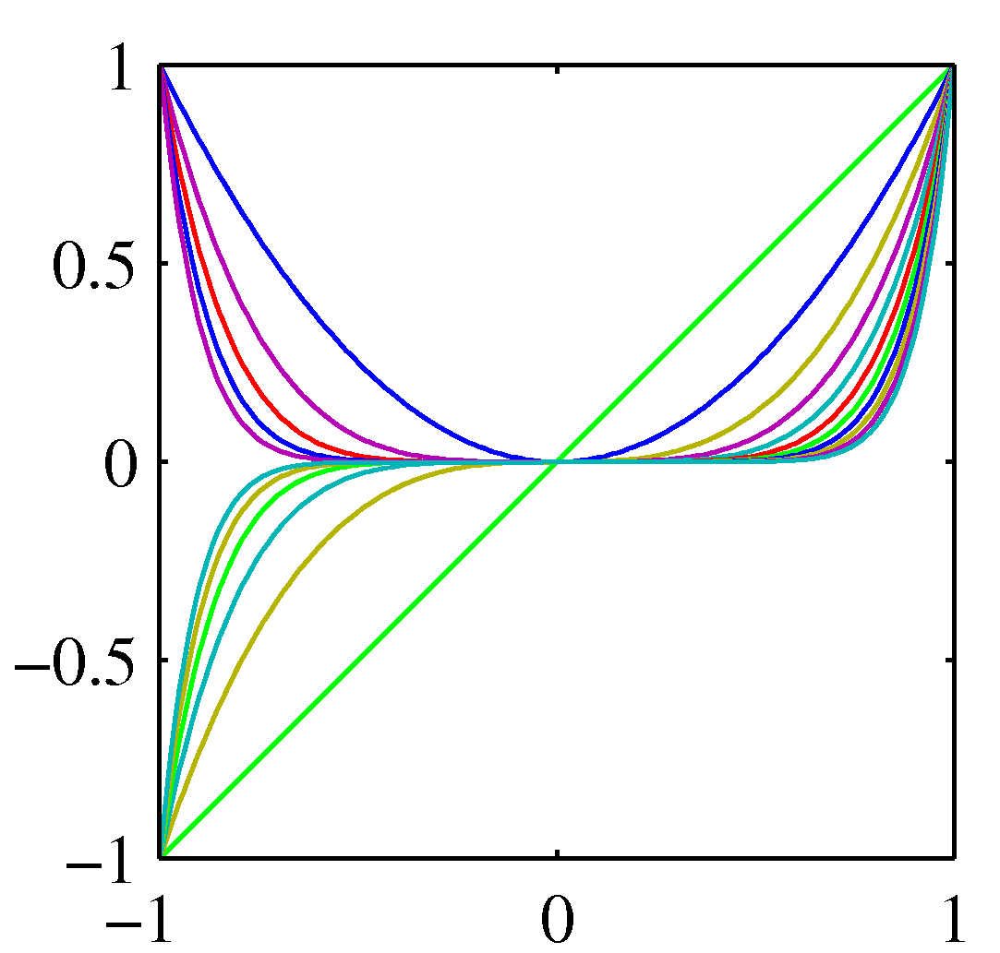
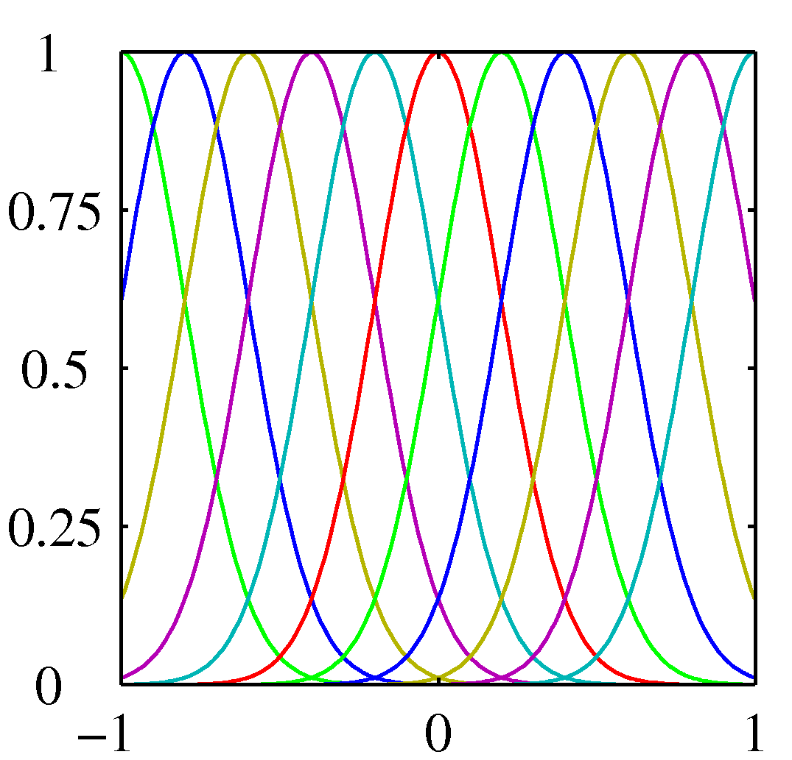
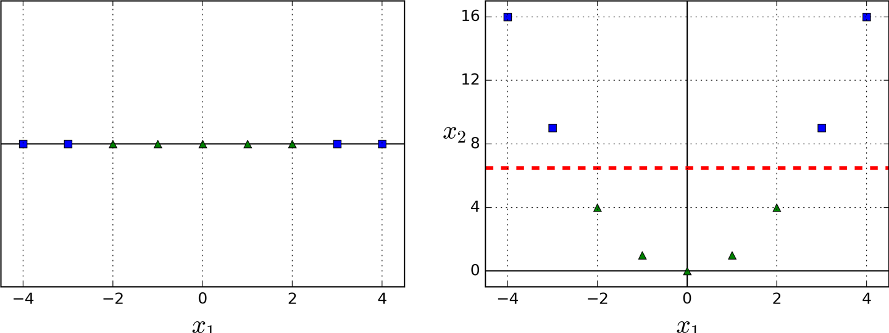
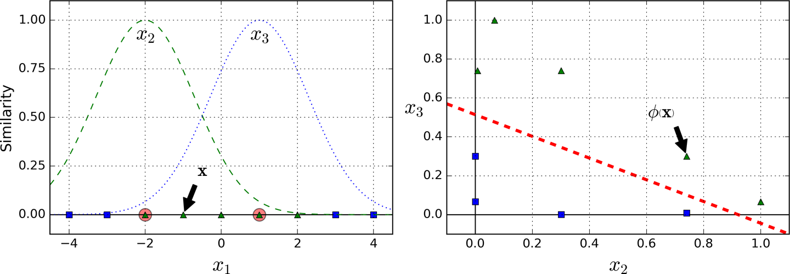

In [linear regression](../ml-math/ml-problem-statement) we have seen a simple dataset that came from an unknown non-linear target function. We then proceeded and chose a polynomial hypothesis that mapped each input example $x$ into a function $g(x, \mathbf w) = \mathbf w^T \phi(\mathbf{x})$, found the optimal $\mathbf w$ by maximizing the likelihood (ML) function using the MSE as the loss function. The moment we have $\mathbf w$ we can use it to do new predictions. 

Pretty much the same approach was met in classification problems such as logistic regression, albeit with datasets that are appropriate to discriminative use cases. 

In both regression and classification we have used a transformation from the raw data $\mathbf x$ to the feature $\phi(\mathbf x)$ and more specifically in the case of linear regression we have used basis functions $\phi_i(\mathbf x)$ from the set of polynomials and as shown below we could have chosen other sets. 

*Polynomial basis functions*

*Gaussian basis functions*

Another technique to tackle nonlinear problems is to add features computed using a similarity function that *measures how much each instance resembles a particular landmark*. For example, let’s take the one-dimensional dataset,

*Adding feature $x_2=(x_1)^2$, can convert a linearly inseparable problem to separable in a feature space*

Add two landmarks to it at $x_1 = –2$ and $x_1 = 1$.

*Adding landmarks and considering a similarity function from the Gaussian Radial Basis Function (RBF) with $\gamma = 0.3$.*

The important property in choosing basis functions is that resultant **kernel functions** allow the computation of dot products in the feature space,

$$ k(\mathbf x_i, \mathbf x_j) = \phi(\mathbf x_i)^T \phi(\mathbf x_j)$$

using only the original data $x_i$ and $x_j$ i.e. without having to calculate or even know about the transformations $\phi$. This is what is called the **kernel trick**. 

Intuitively, this requirement comes from the fact that good kernel functions represent similarities in the feature space and dot products are excellent similarity operators.

With an appropriate kernel function we can transform the raw input to a **higher dimensional** space where our non linear regression model or a non-linearly separable problem become linear and linearly separable respectively. 
